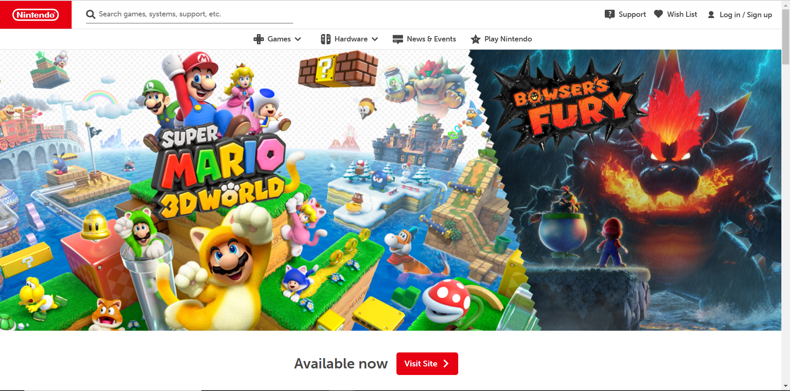

## Back in My Day...

  What was your first intro to HTML?  Was it tumblr, or maybe a college course?  Well, this might give away how old I am, but back in my day--before Facebook--there was something called MySpace.  One of the begining "blog" type websites where you could update statuses, keep a list of friends, upload pictures, and most importantly (to me anyway) customize how your page looks.  Back then it was mostly copying and pasting other people's codes, but after a while you kind of got the hang of what code snippet did what, and you could go in and customize things yourself if you knew how to.  After the premier of Facebook and other social medias, MySpace died down, and everything I had learned about HTML got pushed into the back of my brain shelves, never to be seen again... Until now.
  
## Dusting off the Cobwebs
  A course I'm taking in college right now has required me to find that old HTML box in the back of my brain and dust it off, only to find that the contents inside are, well, basically nothing.  I remembered spending hours customizing my MySpace page, but I did't remember any syntax or how I did it!  I guess that's what happens when you don't use knowledge for over 10 years.  Luckily, this college course started from scratch and as we covered the basics of raw HTML and CSS, a few things started coming back to me.  Things like color codes, or putting images in were all similar to what I remember.  But a lot of things were new and different.  In MySpace, we didn't really have to worry about formatting because basic formatting was given to us, and I definitely don't remember there being any CSS.  The more we learned, the more web design became intimidating.  Surely, one would have to be a wizard at HTML and CSS to build any kind of decent looking web page!
  
## A Semantic Savior
  If you are infact not an HTML and CSS wizard, fear not and rejoice!  There is no need to become one, thanks to the existence of UI Frameworks!  The UI Framework this college course has us working on (so far) is called Semantic UI, and it makes formatting much, much easier.  Although UI Frameworks can be difficult to learn (some even say it's as hard as learning a new language), Semantic UI is based on natural language and seems very beginner friendly.  Many of the commands/names are intuitive and can be guessed, but even when that's not the case, the Semantic UI website has extremely good documentation on what a syntax does, and how to use it.  In my short time of using Semantic UI, I've found it fairly straight-forward and painless.  There are of course still many things I don't know how to do, but few things a quick google search can't solve.  Making replicas of websites for practice has become much more simple, but there are still some things that I can't quite get to look exactly the same.  Overall, if you're new to HTML, or like me you haven't used it since the MySpace days, I would definitely suggest picking up an easy to learn UI Framework to make your life easier!

  
  

Above are screen shots of the original Nintendo website (left) and my version (right) that I created in about an hour using Semantic UI!
