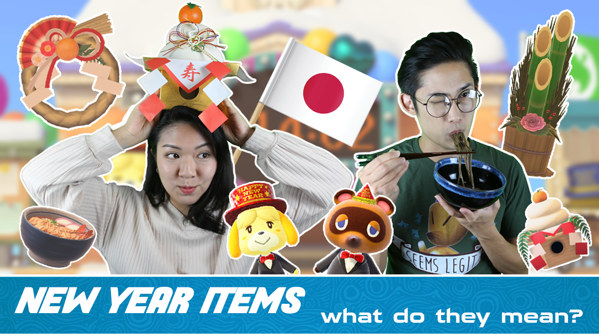

Our YouTube channel UnderLeveled is a recently started project where we make video game related content.  So far even though we've just started in the month of January, 2021, our content has spanned from video game related culture lessons to reviewing video game themed products as well as video games themselves.  Although a YouTube channel about video games may sound like all fun and games, a lot of work goes into creating and maintaining the channel.

Because it's just me and my partner, we both need to pull our fair share of work.  The work that goes into maintaining our YouTube channel spans across more skill fields than I could have ever possibly imagined.  For many videos, a lot of research and fact checking needs to be done before hand--We wouldn't want to spread any false information.  I would say a good amount of prep work for each video goes into making sure what we're saying is true.

Another important aspect of a YouTube channel is design.  Infact, I would say a good majority of whether or not people take interest in your videos goes into the work you put into designing the thumbnails, as well as your icon and banner.  For our YouTube channel, we weren't absolutely confident in our ability to design a logo, so we actually hired someone on Fiverr to do so for us, but the banner and thumbnails we design ourselves in Adobe Photoshop.  We also designed and created a lot of our background ourselves. From the wooden shelves to the dragon head you see hanging on the wall.  The dragon head (or if you're familiar with the game Monster Hunter, Rathalos head) is 3D printed, coated in resin, and air brushed to look as realistic as we could possibly make it.

Last but not least, video editing.  A lot of time is spent in Adobe Premier, cutting, pasting, and syncing video clips, sound effects, and fun images together to create something at least mildly entertaining for viewers to watch.  Sometimes, a scene as long as 5 seconds can take 2 hours to edit depending on the amount of work that goes into it.

[Link to our channel](https://www.youtube.com/channel/UCvfcorurRp7wNSJEGkYWTmg).
