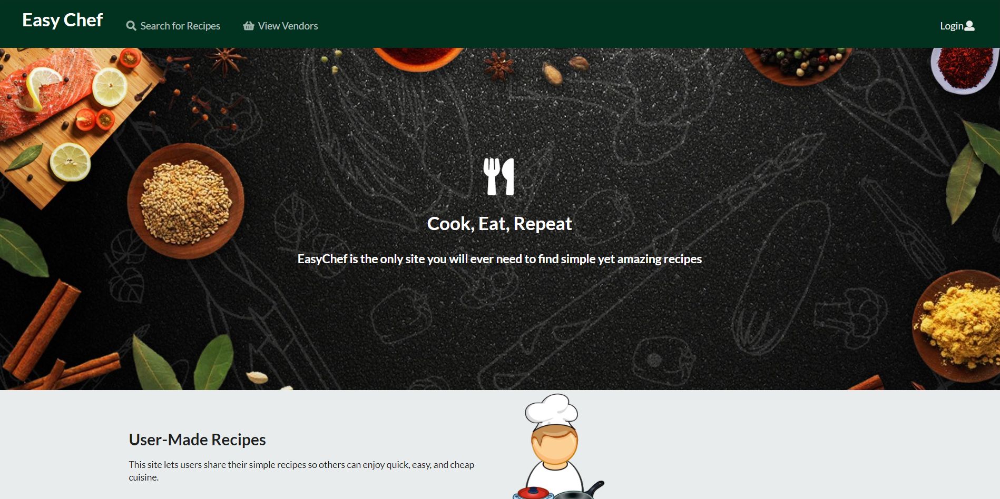
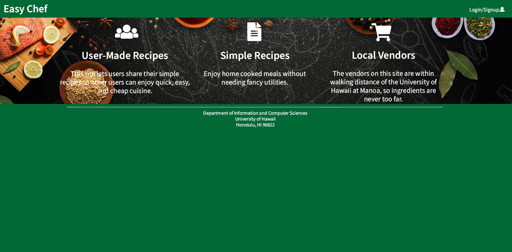
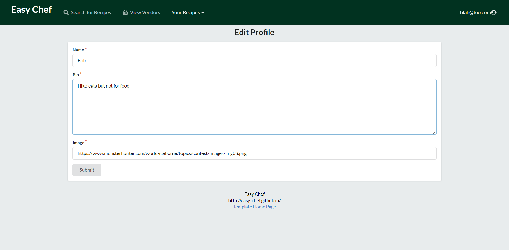
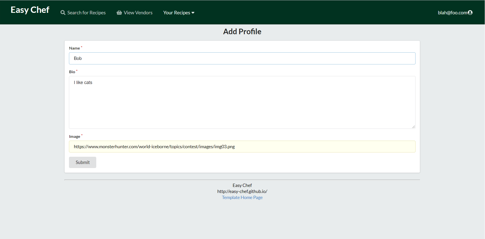
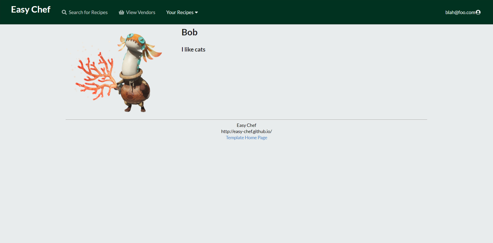
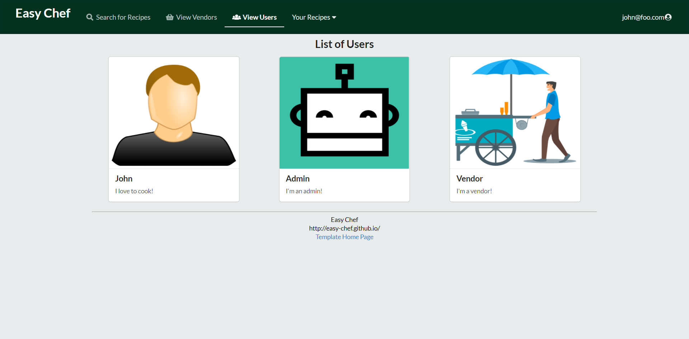

## Introducing Easy Chef

For this project, a group of classmates and I worked on a web application centered around making life a little easier for the struggling college student.  One way to improve a college student's quality of life is by increasing the quality (or just taste) of the food they’re eating, and that’s where Easy Chef comes in.  Easy Chef (our web application) is a website where University of Hawaii students can share their easy to make and cost efficient recipes.  With Easy Chef, hopefully HotPockets and Cup ‘o Noodles will no longer be the only things on the menu for the struggling college student (no matter how tasty they are).

If you'd like to see our GitHub page on Easy Chef:
[Link to our GitHub](https://easy-chef.github.io/)

If you'd like to see the source code on GitHub:
[Link to Source Code](https://github.com/easy-chef/easy-chef)

If you'd like to see how our Easy Chef web application is doing so far:
[Link to our Web Application](https://easychef.xyz/#/)

## My Contributions

To create this project, our team worked over the course of three milestones. In each milestone, a team member was assigned issues to complete. 

### First Milestone

For the first milestone, my contribution was making all the mockups in Photoshop and creating the Landing Page seen at the beginning of this essay.

<footer>Above is the Landing Page mock-up.</footer>

### Second Milestone

For the second milestone, my contribution was to implement the edit user profile function as well as write the Development Guide and User Guide on our github.io website.

Above is the Edit Profile page.

### Third Milestone

For the third milestone, my contribution was to create an add user profile page and implement that so that new users are routed to fill out that form, as well as create a list users page allowing those who are logged in to be able to see all users that access Easy Chef.

<footer>Above is the Add Profile page.</footer>

<footer>Above is how the profile looks after the Add Profile form is submitted.</footer>

<footer>Above is the View Users page.</footer>

## The Many Things I've Learned

This project has been extremely fun and time consuming and over the course of the weeks we’ve been working on it, I feel like I’ve learned so much.  I am definitely a bit more confident in my web application building skills.  I’ve learned more about Meteor and Mongo DB, and through many Google searches I’ve learned a bit more about Semantic UI React.  I’ve also learned more about properly importing, exporting, and rendering pages and components, as well as how to route pages through the App.jsx and link them to menu bar items.  What I wish I was able to learn more about is how to filter through collections to make for better search functions.
